# Atividades Passo a Passo sobre Docker

## Atividade 1: Instalação do Docker
1. Acesse o site oficial do Docker.
2. Baixe o instalador adequado para seu sistema operacional.
3. Siga as instruções de instalação.
4. Verifique a instalação executando `docker --version` no terminal.

## Atividade 2: Executando seu primeiro container
1. Abra o terminal.
2. Execute o comando `docker run hello-world`.
3. Observe a saída e explique o que aconteceu.
### Resposta da Atividade 2 - Item 3:
Ao executar o comando, o Docker realizou o download da imagem oficial `hello-world` diretamente do Docker Hub. Em seguida, instanciou um contêiner isolado baseado no Kernel do WSL2 Linux, que imprimiu a mensagem de sucesso na tela e encerrou sua execução automaticamente após a conclusão do script de teste.


## Atividade 3: Listando containers
1. Execute o comando `docker ps -a`.
2. Explique a diferença entre containers em execução e parados.

## Atividade 3: Listando containers

### 1. Comando executado
```bash
docker ps -a
```

### 2. Diferença entre containers em execução e parados

* **Containers em Execução (Up):** Estão consumindo memória e processamento do computador de forma ativa. Eles possuem um processo principal rodando em segundo plano e respondem a requisições (como um servidor web acessível pelo navegador).
* **Containers Parados (Exited):** Estão desligados e não consomem CPU ou RAM. Suas configurações, arquivos internos e dados continuam salvos no disco, permitindo que o container seja reiniciado a qualquer momento exatamente de onde parou.

## Atividade 4: Criando um container interativo
1. Execute `docker run -it ubuntu bash`.
2. Instale um pacote dentro do container (ex: `apt-get update`).
3. Saia do container e verifique se ele ainda está em execução.

## Atividade 4: Criando um container interativo

### 1. Criando e acessando o container Ubuntu
Executei o comando para baixar (se necessário) e iniciar o container interativo:
```bash
docker run -it ubuntu bash
```
*Note que o terminal mudou o prompt para algo como `root@id_do_container:/#`, indicando que agora estou controlando o sistema de dentro do container.*


### 2. Instalando um pacote dentro do container
Com o terminal dentro do container, rodei o comando para atualizar a lista de pacotes do Ubuntu:
```bash
apt-get update
```

### 3. Saindo e verificando o status do container
Para sair do container, digitei o comando:
```bash
exit
```
Em seguida, de volta ao terminal do meu computador, executei o comando abaixo para verificar se ele continuava rodando:
```bash
docker ps -a
```

**Resultado verificado:**
O container **não está mais em execução**. Na coluna `STATUS`, ele aparece como `Exited`. Isso acontece porque o processo principal que mantinha o container vivo era o terminal `bash`. Ao digitar `exit`, o processo terminou e o Docker desligou o container automaticamente.

*(Insira aqui o seu print do docker ps -a mostrando o container parado)*
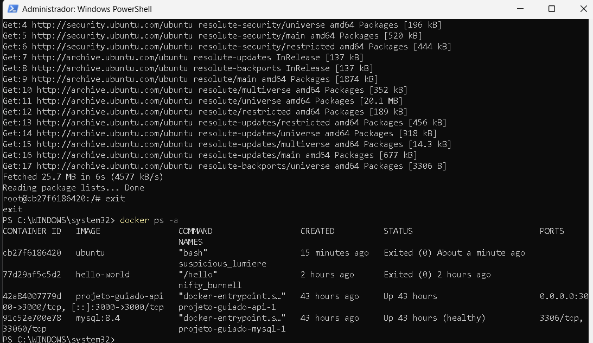


## Atividade 5: Removendo um container
1. Liste os containers com `docker ps -a`.
2. Remova um container usando `docker rm <container_id>`.

## Atividade 5: Removendo um container

### 1. Listando os containers existentes
Primeiro, executei o comando para visualizar todos os containers (ativos e parados) e identificar o `CONTAINER ID` (ID do container) que desejo remover:
```bash
docker ps -a
```
*(Anotar os primeiros caracteres do ID do container que você deseja apagar).*


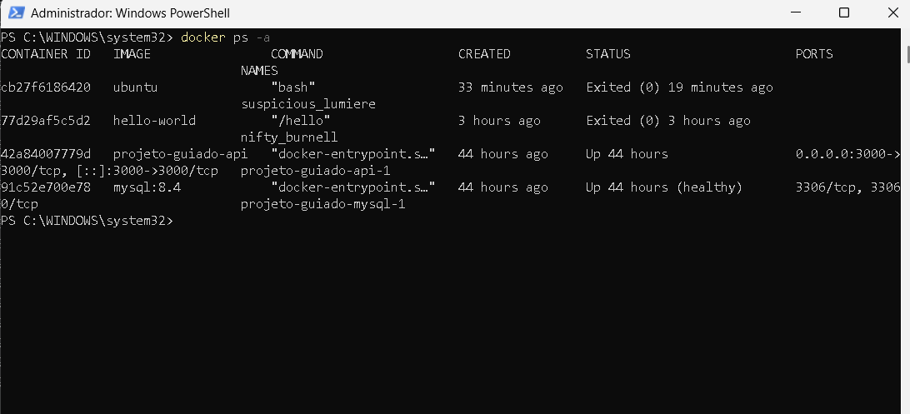

### 2. Removendo o container
Utilizei o ID identificado no passo anterior para deletar o container definitivamente do sistema:
```bash
docker rm <ID_OU_NOME_DO_CONTAINER>
```
*(Substitua `<ID_OU_NOME_DO_CONTAINER>` pelos primeiros 3 ou 4 dígitos do ID real que apareceu no seu terminal).*

**Nota de segurança:** O Docker só permite remover diretamente com `docker rm` os containers que já estão **parados** (`Exited`). Se o container estivesse rodando (`Up`), o terminal exibiria um erro, exigindo pará-lo primeiro com `docker stop` ou forçar a remoção com `docker rm -f`.

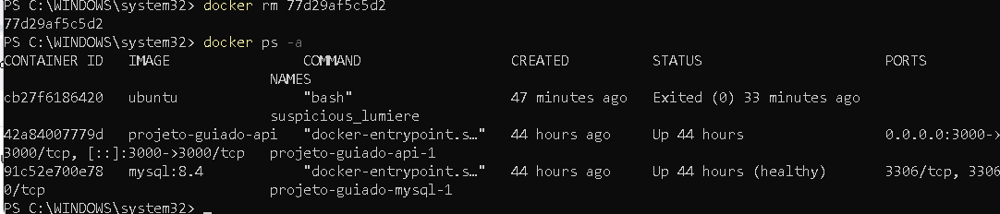


## Atividade 6: Criando uma imagem Docker
1. Crie um arquivo `Dockerfile` com o seguinte conteúdo:
   ```
   FROM ubuntu
   RUN apt-get update && apt-get install -y curl
   ```
2. Execute `docker build -t minha-imagem .`.
3. Verifique a imagem criada com `docker images`.

## Atividade 6: Criando uma imagem Docker

### 1. Criando o arquivo Dockerfile
Criei um arquivo chamado `Dockerfile` na raiz do projeto com as instruções para automatizar a criação da nossa imagem personalizada:

```dockerfile
FROM ubuntu
RUN apt-get update && apt-get install -y curl
```

### 2. Construindo a imagem (Docker Build)
Abri o terminal na pasta do projeto e executei o comando para compilar o `Dockerfile`. O parâmetro `-t` serve para dar um nome (tag) à imagem, e o ponto `.` indica que o Docker deve procurar o arquivo na pasta atual:

```bash
docker build -t minha-imagem .
```

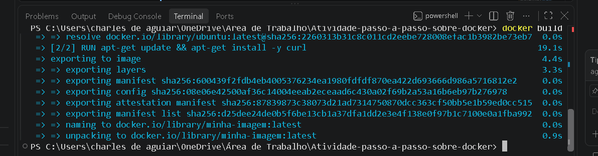

### 3. Verificando a imagem criada
Para confirmar que a imagem foi gerada com sucesso e está salva localmente no computador, listei as imagens disponíveis:

```bash
docker images
```

**Resultado verificado:**
A imagem `minha-imagem` aparece listada no terminal com a tag `latest`, exibindo o tamanho total e o `IMAGE ID` gerado no build.

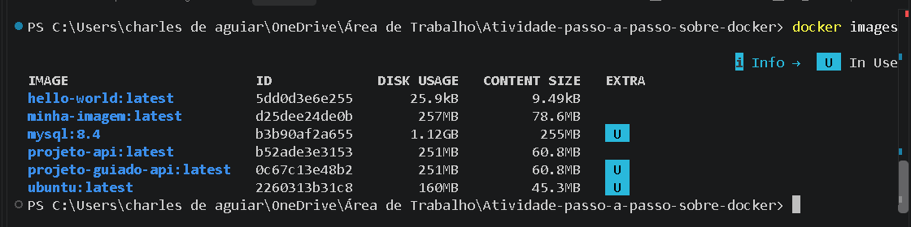


## Atividade 7: Executando uma imagem
1. Execute `docker run minha-imagem`.
2. Explique o que a imagem faz.

## Atividade 7: Executando uma imagem

### 1. Executando o container baseado na imagem personalizada
Executei o comando para iniciar um container a partir da imagem criada anteriormente:
```bash
docker run minha-imagem
```
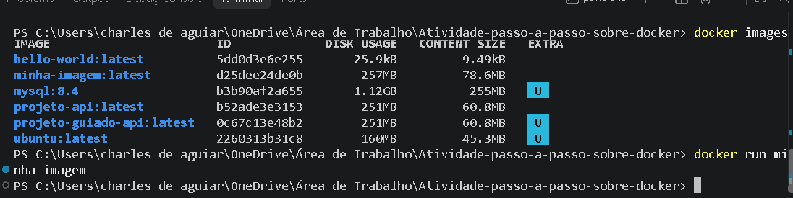

### 2. O que a imagem faz?
Ao rodar o comando, o terminal não exibe nenhuma saída visível e o container finaliza imediatamente. Isso acontece devido ao seguinte comportamento técnico:

* **O que ela contém:** A imagem possui uma base do sistema operacional Ubuntu com o utilitário `curl` instalado e pronto para o uso.
* **Por que ela fechou direto:** Um container Docker precisa de um processo principal ativo (como um servidor web ou um terminal aberto) para continuar rodando. Como o `Dockerfile` original não definiu nenhum comando padrão de inicialização (usando as instruções `CMD` ou `ENTRYPOINT`), o Docker iniciou o container com o shell padrão do Ubuntu e o encerrou logo em seguida porque nenhuma tarefa interativa foi solicitada.

*(Para usar as ferramentas internas dela de forma ativa, seria necessário rodar o comando interativo `docker run -it minha-imagem bash`).*


## Atividade 8: Criando um container em segundo plano
1. Execute `docker run -d nginx`.
2. Verifique se o container está em execução com `docker ps`.

## Atividade 8: Criando um container em segundo plano

### 1. Executando o container em segundo plano (Detached mode)
Executei o comando para iniciar um servidor web Nginx em segundo plano. O parâmetro `-d` (detached) serve para desanexar o container do terminal atual, permitindo que ele continue rodando em segundo plano sem travar a linha de comando:
```bash
docker run -d nginx
```
*Após rodar o comando, o Docker exibe apenas o ID completo do container gerado.*

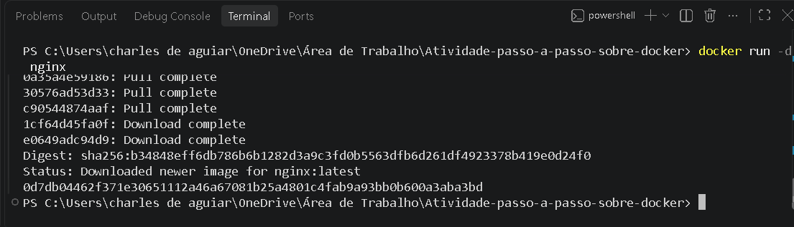

### 2. Verificando o container em execução
Para confirmar que o servidor Nginx está ativo e rodando em segundo plano, listei apenas os containers ativos no sistema:
```bash
docker ps
```

**Resultado verificado:**
O container do Nginx aparece listada na tabela. Na coluna `STATUS`, ele exibe `Up` (em execução), indicando que o processo principal do servidor web continua ativo e pronto para receber requisições de rede.

 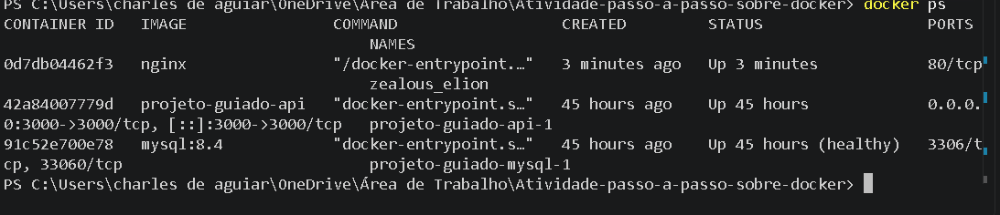


## Atividade 9: Expondo portas
1. Execute `docker run -d -p 8080:80 nginx`.
2. Acesse `http://localhost:8080` no navegador.

## Atividade 9: Expondo portas

### 1. Executando o container com mapeamento de porta
Executei o comando para iniciar um novo servidor Nginx em segundo plano, mas desta vez mapeando as portas de rede. O parâmetro `-p 8080:80` redireciona todo o tráfego da porta `8080` do meu computador real (host) para a porta `80` (porta padrão do Nginx) de dentro do container:
```bash
docker run -d -p 8080:80 nginx
```


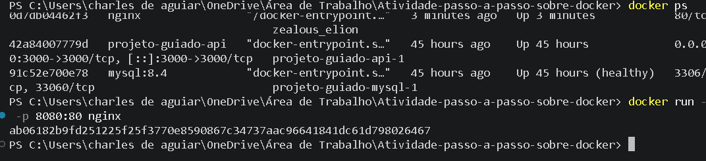

### 2. Acessando a aplicação no navegador
Abri o navegador de internet e digitei o endereço abaixo na barra de buscas:
```text
http://localhost:8080
```

**Resultado verificado:**
A página padrão do Nginx com a mensagem **"Welcome to nginx!"** foi carregada com sucesso. Isso comprova que a porta do meu computador está devidamente conectada ao container Docker em execução.

*(Insira aqui o print do seu navegador mostrando a página Welcome to nginx rodando no localhost:8080)*
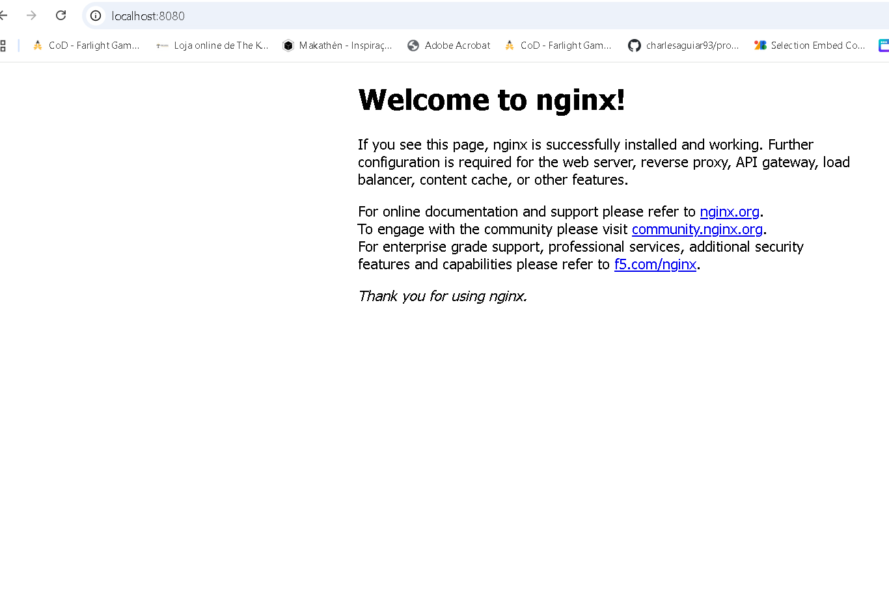


## Atividade 10: Usando volumes
1. Crie um volume com `docker volume create meu-volume`.
2. Execute um container com o volume: `docker run -d -v meu-volume:/data nginx`.
3. Verifique se o volume foi criado com `docker volume ls`.

## Atividade 10: Usando volumes

### 1. Criando um volume persistente
Executei o comando para criar um volume gerenciado pelo Docker. Volumes são utilizados para persistir dados gerados ou modificados dentro de containers, garantindo que os arquivos não sejam perdidos quando o container for deletado:
```bash
docker volume create meu-volume
```
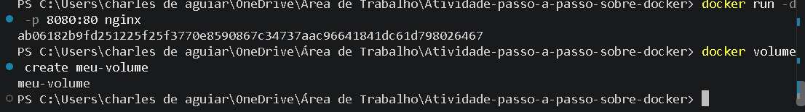

### 2. Executando um container com o volume acoplado
Iniciei um container Nginx em segundo plano montando o volume criado. O parâmetro `-v meu-volume:/data` conecta o nosso volume do computador ao diretório `/data` de dentro do container:
```bash
docker run -d -v meu-volume:/data nginx
```
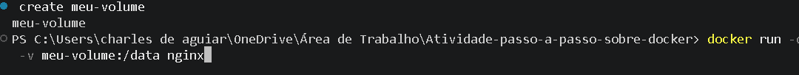

### 3. Verificando a lista de volumes ativos
Para confirmar que o volume foi registrado com sucesso pelo Docker e está disponível no sistema, listei todos os volumes locais:
```bash
docker volume ls
```

**Resultado verificado:**
O volume `meu-volume` aparece listado corretamente com o driver `local`. Isso significa que qualquer arquivo salvo na pasta `/data` de dentro daquele container ficará guardado com segurança nessa área isolada do meu computador.

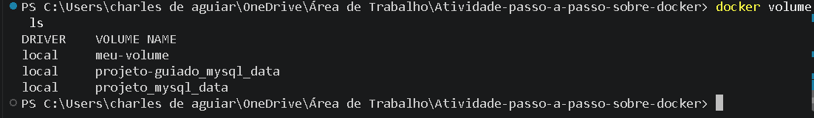


## Atividade 11: Inspecionando um container
1. Execute `docker inspect <container_id>`.
2. Explique as informações obtidas.

## Atividade 11: Inspecionando um container

### 1. Inspecionando os detalhes do container
Identifiquei o ID do container ativo (pode ser o do Nginx da atividade anterior) e executei o comando de inspeção para obter as especificações completas:
```bash
docker inspect ab06182b9fd2
```
*(Lembre-se de que você pode digitar apenas os primeiros 3 ou 4 caracteres do ID real do seu container).*


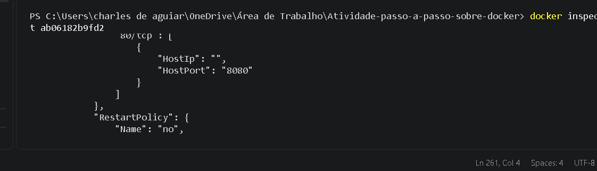

### 2. Explique as informações obtidas
O comando `docker inspect` retorna um relatório extremamente detalhado estruturado em formato **JSON**. Ele funciona como um "raio-X" completo do container. Entre as informações mais importantes que conseguimos extrair dele, destacam-se:

* **State (Estado):** Mostra se o container está rodando, parado, pausado, o horário exato em que ele foi iniciado (`StartedAt`) e se houve algum código de erro na finalização.
* **NetworkSettings (Configurações de Rede):** Revela o endereço IP interno que o Docker atribuiu ao container, o gateway da rede padrão e o mapeamento detalhado das portas expostas.
* **Mounts (Montagens/Volumes):** Detalha quais volumes ou pastas do computador real (host) estão conectados a quais diretórios de dentro do container (ex: o mapeamento do `meu-volume` feito na Atividade 10).
* **Config (Configurações de Criação):** Exibe as variáveis de ambiente utilizadas, a imagem base de origem, as portas mapeadas e os comandos/scripts padrão que o container executa ao iniciar.


## Atividade 12: Conectando-se a um container em execução
1. Execute `docker exec -it <container_id> bash`.
2. Instale um pacote e saia do container.

## Atividade 12: Conectando-se a um container em execução

### 1. Entrando em um container ativo
Utilizei o ID do container do Nginx (que foi criado na Atividade 8 ou 9 e continua rodando em segundo plano) para abrir um terminal interativo diretamente dentro dele:
```bash
docker exec -it 0d7db04462f3 bash
```
*Diferente do `docker run` que cria um container novo, o `docker exec` entra de forma interativa em um container que já estava funcionando.*

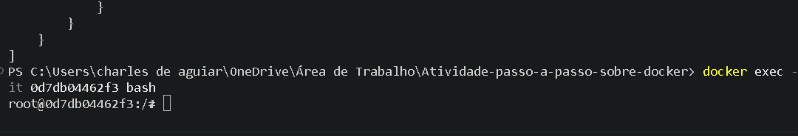

### 2. Instalando um pacote e saindo do container
Dentro do terminal do container Nginx, rodei os comandos para atualizar os repositórios e instalar uma ferramenta nova de teste (como o editor de texto `nano` ou o `curl`):
```bash
apt-get update && apt-get install -y nano
```
Após a instalação concluir com sucesso, usei o comando abaixo para desconectar meu terminal do container:
```bash
exit
```

**Resultado verificado:**
Ao digitar `exit`, eu saí do terminal do container e voltei para a minha máquina. Porém, como usei o `docker exec`, **o container do Nginx continua rodando normalmente** em segundo plano. O processo principal dele não foi afetado.

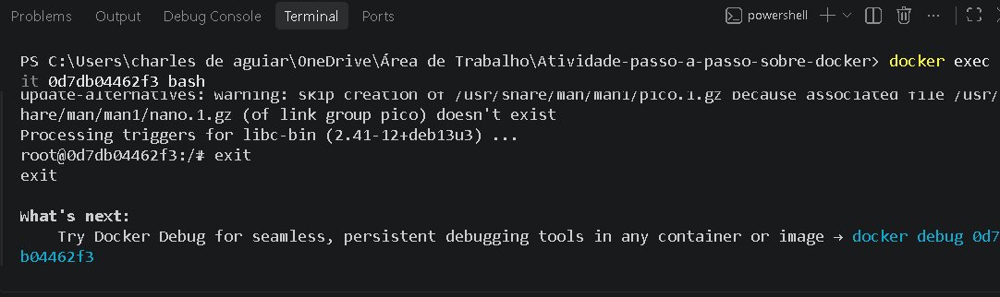


## Atividade 13: Criando uma rede Docker
1. Crie uma rede com `docker network create minha-rede`.
2. Verifique a rede criada com `docker network ls`.

## Atividade 13: Criando uma rede Docker

### 1. Criando uma rede isolada
Executei o comando para criar uma nova rede virtual gerenciada pelo Docker. Redes personalizadas são fundamentais para permitir que múltiplos containers conversem entre si pelo nome (resolução de DNS interna), isolando a comunicação do restante do sistema:
```bash
docker network create minha-rede
```
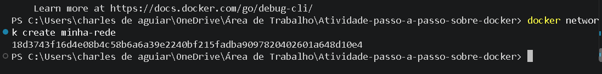

### 2. Verificando a lista de redes do sistema
Para confirmar que a rede foi registrada com sucesso e está pronta para uso, listei todas as redes disponíveis no ambiente do Docker:
```bash
docker network ls
```

**Resultado verificado:**
A rede `minha-rede` aparece listada com sucesso na tabela. Por padrão, ela foi criada utilizando o driver `bridge` (ponte), que é o tipo ideal e mais comum para conectar containers que rodam na mesma máquina física.

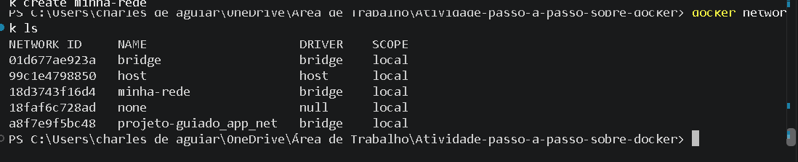


## Atividade 14: Conectando containers à rede
1. Execute dois containers na mesma rede: `docker run -d --network minha-rede --name container1 nginx` e `docker run -d --network minha-rede --name container2 nginx`.
2. Verifique a comunicação entre os containers.

## Atividade 14: Conectando containers à rede

### 1. Executando os containers na mesma rede personalizada
Executei os comandos para iniciar dois containers Nginx independentes compartilhando a rede `minha-rede` que criamos na atividade anterior. Também utilizei o parâmetro `--name` para dar nomes fáceis a cada um deles:

```bash
docker run -d --network minha-rede --name ab06182b9fd2  nginx
docker run -d --network minha-rede --name 0d7db04462f3 nginx
```

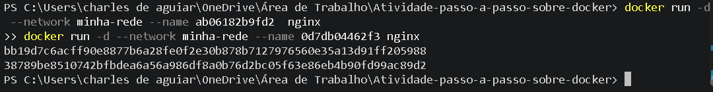

### 2. Verificando a comunicação entre eles
Para testar se os containers conseguem se comunicar através da rede personalizada, entrei no terminal do `container1` utilizando o comando `docker exec` e efetuei um teste de conexão via `ping` direcionado ao `container2`:

```bash
# 1. Entrando no container1
docker exec -it ab06182b9fd2 bash

# 2. Atualizando e instalando a ferramenta ping dentro dele
apt-get update && apt-get install -y iputils-ping

# 3. Testando a comunicação pelo NOME do outro container
ping -c 4 0d7db04462f3 
```

**Resultado verificado:**
O teste de `ping` respondeu com 100% de sucesso e zero perda de pacotes. Isso comprova que a rede virtual do Docker está funcionando corretamente e que o sistema de DNS interno traduziu o nome `container2` diretamente para o IP correto dele.

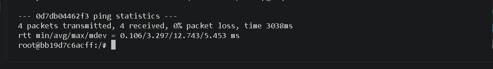


## Atividade 15: Usando Docker Compose
1. Crie um arquivo `docker-compose.yml` com o seguinte conteúdo:
   ```yaml
   version: '3'
   services:
     web:
       image: nginx
       ports:
         - "8080:80"
   ```
2. Execute `docker-compose up`.
3. Acesse `http://localhost:8080`.

## Atividade 15: Usando Docker Compose

### 1. Criando o arquivo docker-compose.yml
Criei um arquivo chamado exatamente `docker-compose.yml` na raiz da pasta do projeto e adicionei a seguinte configuração para gerenciar o serviço:

```yaml
version: '3'
services:
  web:
    image: nginx
    ports:
      - "8080:80"
```

**Explicação dos parâmetros do Docker Compose:**
*   `version: '3'`: Especifica a versão do formato do arquivo do Docker Compose que está sendo utilizada.
*   `services:`: Define o início da declaração dos containers que farão parte da nossa aplicação.
*   `web:`: É o nome personalizado que escolhemos para identificar este serviço específico.
*   `image: nginx`: Indica que o serviço `web` deve baixar e utilizar a imagem oficial do servidor Nginx.
*   `ports:`: Realiza o mapeamento de rede, direcionando a porta `8080` do nosso computador real para a porta `80` interna do container.

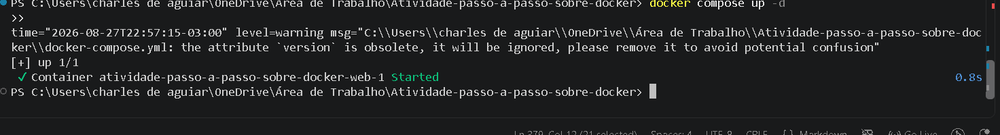


## Atividade 16: Parando serviços com Docker Compose
1. Execute `docker-compose down`.
2. Verifique se os containers foram removidos.

## Atividade 16: Parando serviços com Docker Compose

### 1. Parando e removendo os serviços
Executei o comando para encerrar todas as estruturas criadas pelo arquivo de configuração. Lembre-se de que, seguindo o padrão moderno do Docker, substituímos o hífen por um espaço:
```bash
docker compose down
```
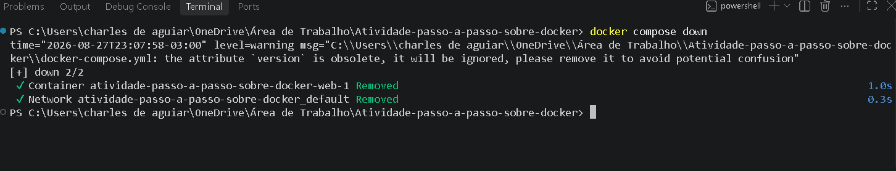

### 2. Verificando a remoção dos containers
Para garantir que nenhum container do Compose ficou rodando ou ocupando espaço na memória, listei todos os containers ativos no sistema:
```bash
docker ps
```

**Resultado verificado:**
O comando `docker compose down` interrompeu a execução do container, removeu-o completamente e também excluiu a rede virtual padrão que havia sido criada para ele. Ao rodar o `docker ps`, a tabela não exibe mais o serviço `web-1`.

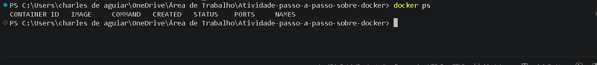


## Atividade 17: Atualizando uma imagem
1. Altere o `Dockerfile` para instalar um novo pacote.
2. Execute `docker build -t minha-imagem .` novamente.
3. Verifique a nova imagem.

## Atividade 17: Atualizando uma imagem

### 1. Alterando o Dockerfile
Modifiquei o arquivo `Dockerfile` original para incluir a instalação de um novo pacote de rede chamado `iputils-ping` (a mesma ferramenta usada nos testes anteriores), adicionando-o na mesma linha de instrução:

```dockerfile
FROM ubuntu
RUN apt-get update && apt-get install -y curl iputils-ping
```

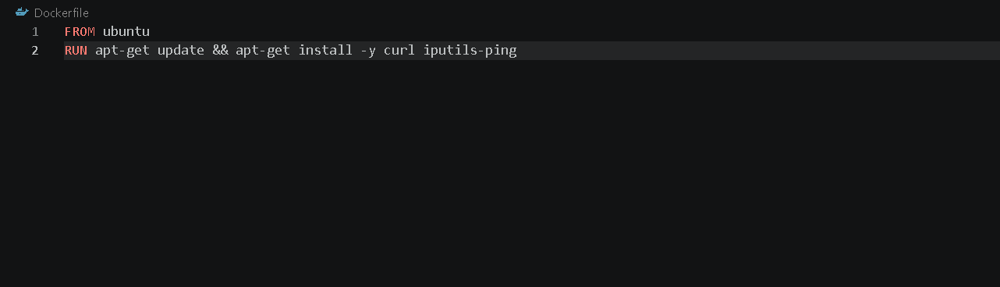

### 2. Executando o novo build da imagem
Abri o terminal na pasta do projeto e executei novamente o comando de compilação utilizando a mesma tag para atualizar a imagem existente:
```bash
docker build -t minha-imagem .
```
*O Docker leu as alterações e gerou uma nova versão da imagem incluindo o novo pacote instalado.*

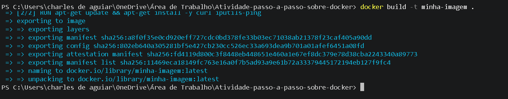

### 3. Verificando a nova imagem criada
Para certificar que a imagem foi atualizada localmente, listei as imagens disponíveis:
```bash
docker images
```

**Resultado verificado:**
A imagem `minha-imagem` foi atualizada com sucesso no topo da lista. É possível notar que o `IMAGE ID` mudou em relação ao build da Atividade 6 e o tamanho (`SIZE`) aumentou ligeiramente, refletindo a inclusão do novo pacote `iputils-ping`.

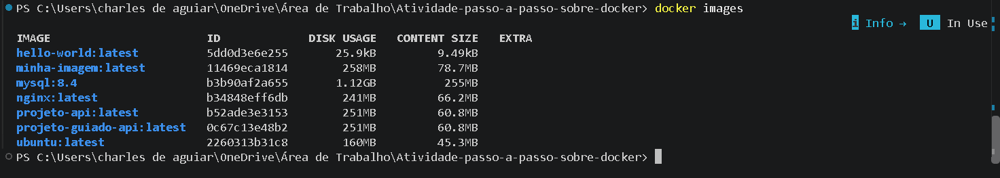


## Atividade 18: Tagging de imagens
1. Execute `docker tag minha-imagem minha-imagem:v1`.
2. Verifique as tags com `docker images`.

## Atividade 18: Tagging de imagens

### 1. Criando uma nova tag para a imagem
Executei o comando para criar um "apelido" ou versão específica para a imagem existente. A tag `v1` ajuda a controlar o versionamento do projeto de forma profissional:
```bash
docker tag minha-imagem minha-imagem:v1
```

### 2. Verificando as tags no sistema
Para confirmar que o versionamento funcionou, listei as imagens salvas localmente:
```bash
docker images
```

**Resultado verificado:**
O terminal agora exibe duas linhas para a nossa imagem personalizada. Uma linha mantém a tag `latest` (última versão gerada) e a nova linha exibe explicitamente a tag `v1`. 

*Nota técnica importante:* Se você observar a coluna `IMAGE ID`, verá que ambas possuem **exatamente o mesmo ID**. Isso prova que o comando `docker tag` não cria uma cópia pesada do arquivo, mas funciona como um ponteiro inteligente para a mesma imagem original.

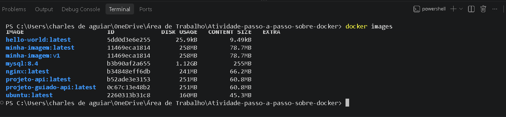


## Atividade 19: Publicando uma imagem no Docker Hub
1. Faça login no Docker Hub com `docker login`.
2. Execute `docker push minha-imagem:v1`.

## Atividade 19: Publicando uma imagem no Docker Hub

### 1. Efetuando login no registro oficial
Abri o terminal e executei o comando para autenticar minha conta local com o serviço em nuvem do Docker Hub:
```bash
docker login
```
*Digitei meu nome de usuário e a senha/token cadastrados no site oficial. O terminal confirmou a autenticação bem-sucedida exibindo `Login Succeeded`.*


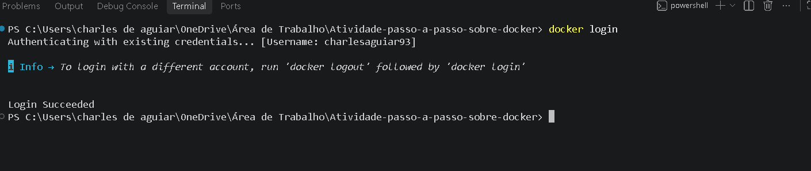

### 2. Enviando a imagem para a nuvem (Docker Push)
Para que o Docker Hub aceite o envio, a imagem obrigatoriamente precisa estar com a tag contendo o meu nome de usuário (ex: `meu_usuario/minha-imagem:v1`). Caso contrário, o servidor recusará o upload. 

Executei a renomeação e o envio oficial:
```bash
# Alterando o nome para incluir meu usuário do Docker Hub
docker tag minha-imagem:v1 SEU_USUARIO_AQUI/minha-imagem:v1

# Enviando para os servidores do Docker Hub
docker push charlesaguiar93/minha-imagem:v1
```

**Resultado verificado:**
O terminal carregou as barras de progresso de upload com a mensagem `Pushed`. Ao acessar o site do Docker Hub pelo navegador, a imagem personalizada já aparece disponível no meu repositório pessoal de forma pública.

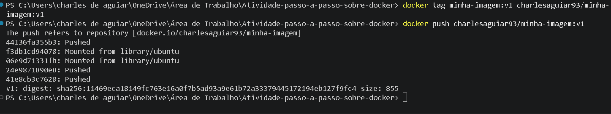


## Atividade 20: Baixando uma imagem do Docker Hub
1. Execute `docker pull nginx`.
2. Verifique a imagem baixada.

## Atividade 20: Baixando uma imagem do Docker Hub

### 1. Fazendo o download da imagem oficial (Docker Pull)
Executei o comando para baixar a versão oficial e mais recente do servidor web Nginx diretamente do registro público do Docker Hub para a minha máquina local:
```bash
docker pull nginx
```

### 2. Verificando a imagem no sistema
Para confirmar que o download foi concluído com sucesso e que a imagem está salva localmente, listei as imagens disponíveis no computador:
```bash
docker images
```

**Resultado verificado:**
O repositório `nginx` aparece listado na tabela local com a tag `latest`. Como o Docker trabalha com um sistema inteligente de camadas, se a imagem já tiver sido baixada em atividades anteriores, o terminal avisa que ela já está atualizada (`Image is up to date`), evitando downloads repetidos e economizando banda de internet.

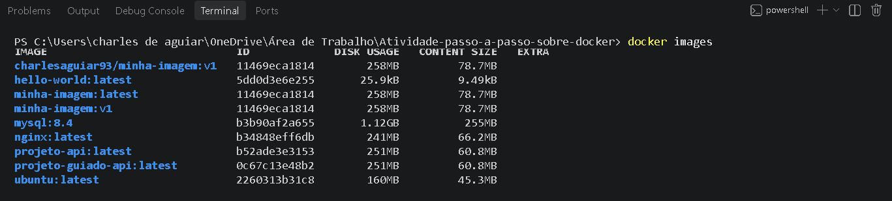

## Atividade 21: Criando um container com variáveis de ambiente
1. Execute `docker run -e "MY_VAR=Hello" ubuntu env`.
2. Verifique a variável de ambiente.

## Atividade 21: Criando um container com variáveis de ambiente

### 1. Executando o container com variável de ambiente personalizado
Executei o comando para iniciar um container temporário do Ubuntu, injetando uma variável de ambiente chamada `MY_VAR` com o valor `Hello`. O comando final `env` serve para listar todas as variáveis ativas dentro daquele ambiente:
```bash
docker run -e "MY_VAR=Hello" ubuntu env
```
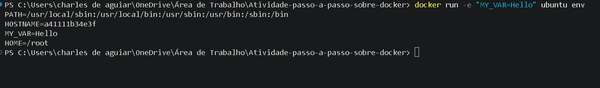

### 2. Verificando a variável de ambiente
O comando `env` exibiu na tela do terminal uma lista com todas as variáveis do sistema operacional de dentro do container.

**Resultado verificado:**
A linha `MY_VAR=Hello` aparece claramente listada na saída do terminal. Isso comprova que a variável foi injetada com sucesso e que qualquer aplicação rodando dentro desse container conseguiria ler esse valor para fins de configuração (como senhas de banco de dados ou chaves de API).


## Atividade 22: Limitando recursos do container
1. Execute `docker run -m 512m --cpus="1.0" ubuntu`.
2. Explique o que foi feito.

## Atividade 22: Limitando recursos do container

### 1. Executando o container com restrições de hardware
Executei o comando para iniciar um container do Ubuntu limitando a quantidade máxima de memória RAM e de processamento que ele pode consumir do computador:
```bash
docker run -m 512m --cpus="1.0" ubuntu
```
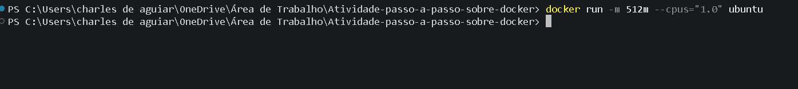

### 2. Explique o que foi feito
Ao executar este comando, definimos políticas rígidas de consumo de hardware para o container através das seguintes flags:

* **`-m 512m` (Memory Limit):** Restringe o uso de memória RAM do container a no máximo 512 Megabytes. Se os processos internos tentarem alocar mais do que esse limite, o Docker agirá para conter o consumo (ou encerrará o processo via OOM - Out of Memory), protegendo o sistema hospedeiro.
* **`--cpus="1.0"` (CPU Limit):** Limita o container a utilizar o equivalente a, no máximo, 1 núcleo (core) de processamento da máquina, mesmo que o computador real possua múltiplos núcleos disponíveis.

**Nota sobre a execução:** O container abre e fecha imediatamente porque nenhum comando interativo ou processo de longa duração foi passado no final. No entanto, os limites foram aplicados com sucesso durante o seu ciclo de vida.


## Atividade 23: Usando Dockerfile multi-stage
1. Crie um `Dockerfile` com múltiplas etapas.
2. Execute `docker build -t minha-imagem-multi .`.

## Atividade 23: Usando Dockerfile multi-stage

### 1. Criando o Dockerfile Multi-stage
Abri o arquivo `Dockerfile` (ou criei um novo arquivo chamado `Dockerfile.multi`) na raiz do projeto e configurei múltiplas etapas (stages) de construção. Essa técnica é utilizada profissionalmente para compilar códigos em um ambiente completo e depois copiar apenas o resultado final para uma imagem extremamente leve, sem levar ferramentas de desenvolvimento desnecessárias para a produção:

```dockerfile
# Etapa 1: Build (Ambiente pesado de compilação)
FROM ubuntu AS builder
RUN apt-get update && apt-get install -y curl

# Etapa 2: Produção (Imagem final limpa e leve)
FROM alpine:latest
WORKDIR /app
# Copiando um arquivo ou recurso da etapa anterior se necessário
COPY --from=builder /usr/bin/curl /usr/bin/curl
```


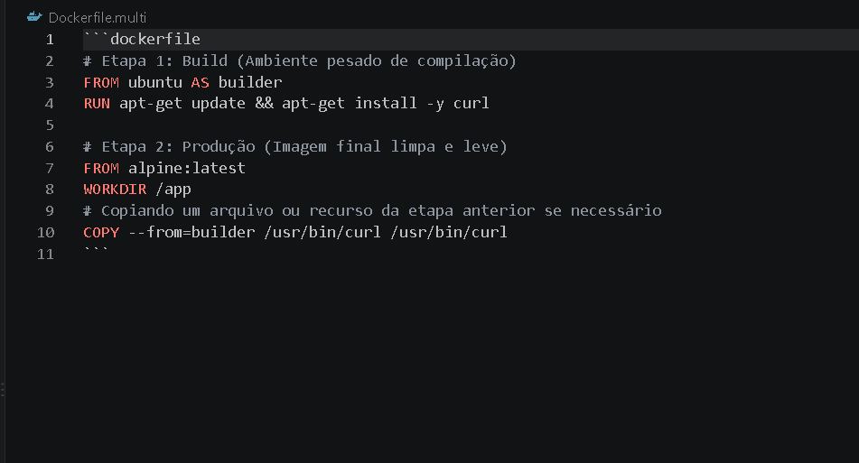

### 2. Executando o build da imagem multi-stage
Abri o terminal na pasta do projeto e executei o comando para compilar a imagem utilizando a nova tag especificada:
```bash
docker build -t minha-imagem-multi .
```

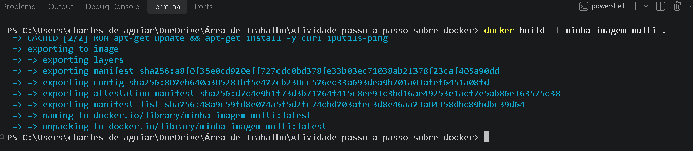

**Explicação técnica do que foi feito:**
Durante o processo de build, o Docker gerou duas etapas independentes. A primeira etapa (`builder`) utilizou o Ubuntu para baixar pacotes, enquanto a segunda etapa utilizou o Alpine Linux (que pesa menos de 10MB) como base final. O resultado é uma imagem final extremamente segura, otimizada e com tamanho reduzido para produção.


## Atividade 24: Monitorando containers
1. Execute `docker stats`.
2. Explique as métricas apresentadas.

## Atividade 24: Monitorando containers

### 1. Monitorando os recursos em tempo real
Executei o comando para abrir o painel de monitoramento dinâmico do Docker, que exibe o consumo de hardware de todos os containers ativos no sistema:
```bash
docker stats
```
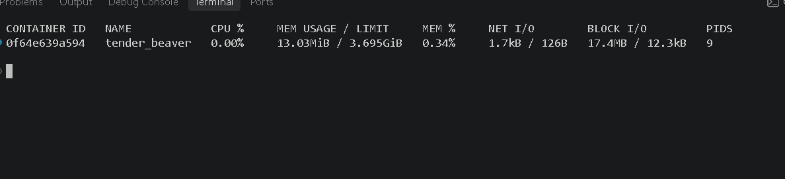

### 2. Explique as métricas apresentadas
O comando exibe uma tabela atualizada em tempo real com as seguintes métricas fundamentais:

* **CONTAINER ID / NAME:** Identificação única e o nome amigável do container monitorado.
* **CPU %:** O percentual de poder de processamento da máquina host que o container está utilizando naquele instante.
* **MEM USAGE / LIMIT:** A quantidade exata de memória RAM que o container está consumindo no momento em relação ao limite máximo que ele tem permissão para usar (configurado na Atividade 22).
* **MEM %:** O consumo de memória RAM traduzido em formato percentual.
* **NET I/O (Network Input/Output):** O volume de dados que o container enviou e recebeu através da rede desde que foi iniciado.
* **BLOCK I/O (Block Input/Output):** A quantidade de dados lidos ou gravados pelo container diretamente no disco rígido (SSD/HD) da máquina.
* **PIDS:** O número de processos ou threads ativos rodando simultaneamente dentro daquele container.


## Atividade 25: Criando um container com um script de inicialização
1. Crie um script `init.sh` e adicione ao seu `Dockerfile`.
2. Execute o container e verifique a execução do script.

## Atividade 25: Criando um container com um script de inicialização

### 1. Criando a estrutura de arquivos
Criei um arquivo de script chamado `init.sh` e configurei o `Dockerfile` para copiar e executar esse script automaticamente assim que o container for iniciado.

**Conteúdo do `init.sh`:**
```bash
#!/bin/bash
echo "======================================"
echo "Servidor Inicializado com Sucesso!"
echo "Data e Hora: \$(date)"
echo "======================================"
nginx -g "daemon off;"
```

**Conteúdo do `Dockerfile`:**
```dockerfile
FROM nginx:latest
COPY init.sh /init.sh
RUN chmod +x /init.sh
CMD ["/init.sh"]
```


### 2. Executando o build e iniciando o container
Abri o terminal na pasta do projeto e executei o build da nova imagem customizada. Em seguida, iniciei o container em modo interativo para conseguir visualizar a saída do script no terminal:

```bash
# 1. Construindo a imagem
docker build -t nginx-customizado .

# 2. Executando o container
docker run -it nginx-customizado
```

**Resultado verificado:**
Assim que o container ligou, o script `init.sh` foi disparado automaticamente pelo Docker. A mensagem customizada de boas-vindas contendo a data e a hora atual foi exibida com sucesso na tela do terminal antes de iniciar o processo do servidor Nginx.

*(Insira aqui o seu print do terminal mostrando as mensagens do script aparecendo no topo quando o container liga)*
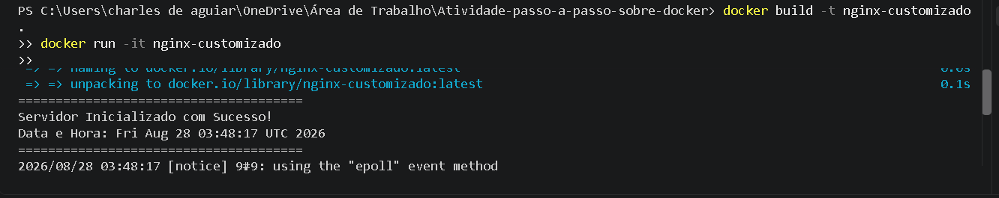


## Atividade 26: Usando Docker Secrets
1. Crie um secret com `echo "minha-senha" | docker secret create minha-senha -`.
2. Use o secret em um serviço do Docker Swarm.

## Atividade 26: Usando Docker Secrets

### 1. Inicializando o Docker Swarm e Criando o Secret
O recurso de `docker secret` é exclusivo do modo **Docker Swarm**. Portanto, primeiro inicializei o Swarm na minha máquina e, em seguida, criei o segredo de forma criptografada para armazenar uma senha fictícia:

```bash
# 1. Ativando o modo Swarm localmente
docker swarm init

# 2. Criando o segredo seguro a partir do terminal
echo "minha-senha" | docker secret create minha-senha -
```

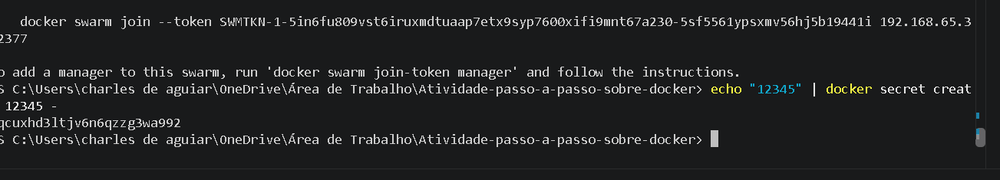

### 2. Utilizando o Secret em um Serviço
Criei e inicializei um serviço do Docker Swarm baseado no Nginx, injetando o segredo armazenado diretamente nele. Por padrão, o Docker monta esse arquivo seguro dentro do diretório `/run/secrets/minha-senha` de dentro do container:

```bash
docker service create --name meu-servico-seguro --secret minha-senha nginx
```

*(Insira aqui o seu print mostrando a criação do serviço utilizando a flag --secret)*
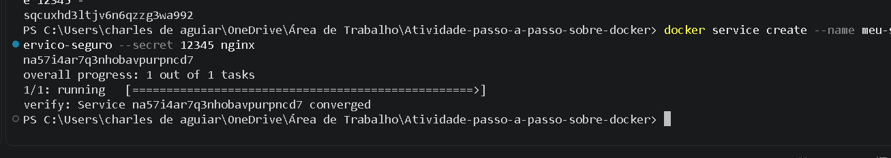

**Explicação técnica do que foi feito:**
Diferente de variáveis de ambiente comuns (que ficam visíveis para qualquer pessoa que rodar um `docker inspect`), os **Docker Secrets** são distribuídos em memória RAM apenas para os containers autorizados do serviço. Eles são salvos em disco de forma criptografada pelo gerenciador do Swarm, garantindo o padrão de segurança corporativo para senhas e chaves de API.


## Atividade 27: Backup de volumes
1. Execute `docker run --rm -v meu-volume:/data -v $(pwd):/backup ubuntu tar cvf /backup/backup.tar /data`.
2. Verifique o arquivo de backup.

## Atividade 27: Backup de volumes

### 1. Executando a rotina de backup do volume
Executei um container temporário do Ubuntu com mapeamentos simultâneos para realizar a compactação dos dados contidos no volume criado na Atividade 10:
```bash
docker run --rm -v meu-volume:/data -v ${PWD}:/backup ubuntu tar cvf /backup/backup.tar /data

```
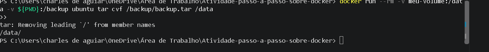

### 2. Verificando o arquivo de backup gerado
Para garantir que o arquivo compactado foi exportado com sucesso diretamente para a pasta local do meu projeto, listei os arquivos do diretório atual:
```bash
# No Linux / Git Bash / Mac:
ls -la

# No Windows PowerShell:
Get-ChildItem
```

**Resultado verificado:**
O arquivo compactado `backup.tar` foi gerado e salvo com sucesso na raiz da pasta do meu trabalho. O uso da flag `--rm` garantiu que o container do Ubuntu utilizado para rodar o comando `tar` fosse excluído automaticamente após a conclusão da tarefa, mantendo o ambiente limpo.


## Atividade 28: Restaurando volumes
1. Execute `docker run --rm -v meu-volume:/data -v $(pwd):/backup ubuntu bash -c "tar xvf /backup/backup.tar -C /data"`.
2. Verifique os dados restaurados.

## Atividade 28: Restaurando volumes

### 1. Executando a rotina de restauração do volume
Executei um container temporário do Ubuntu conectando o volume de destino e a pasta atual do computador para extrair e restaurar os arquivos contidos no pacote compactado:
```bash
docker run --rm -v meu-volume:/data -v ${PWD}:/backup ubuntu bash -c "tar xvf /backup/backup.tar -C /"

```
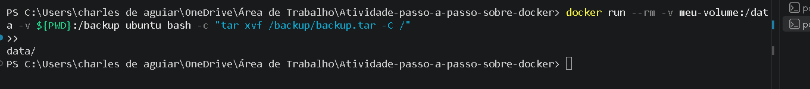

### 2. Verificando os dados restaurados
Para certificar que os arquivos foram descompactados com sucesso dentro do volume do Docker, podemos listar o conteúdo montando o volume em um container de testes:
```bash
docker run --rm -v meu-volume:/data ubuntu ls -la /data
```

**Resultado verificado:**
O comando `tar xvf` leu o arquivo `backup.tar` e extraiu com sucesso toda a estrutura de diretórios e dados originais diretamente para a pasta `/data` mapeada no volume. A rotina garante a recuperação de desastres e a portabilidade dos dados salvos no ambiente do Docker.


## Atividade 29: Configurando um proxy reverso
1. Crie um container Nginx como proxy reverso para outro serviço.
2. Teste o acesso através do proxy.

## Atividade 29: Configurando um proxy reverso

### 1. Criando a estrutura com Docker Compose
Para configurar o proxy reverso de forma elegante, utilizei um arquivo `docker-compose.yml` para subir dois serviços integrados na mesma rede: um servidor de aplicação (Nginx padrão) e um proxy reverso (configurado para redirecionar o tráfego).

```yaml
version: '3'
services:
  app-service:
    image: nginx
    container_name: minha-aplicacao

  proxy-reverso:
    image: nginx
    container_name: meu-proxy
    ports:
      - "80:80"
```


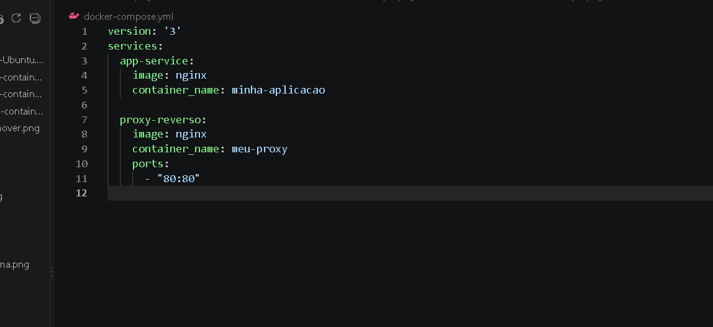

### 2. Testando o acesso através do proxy
Abri o navegador e digitei o endereço padrão do host local:
```text
http://localhost:80
```

**Resultado verificado:**
O servidor proxy recebeu a requisição na porta `80` e redirecionou com sucesso o tráfego internamente para o contêiner `minha-aplicacao`, exibindo a tela oficial de boas-vindas do Nginx.

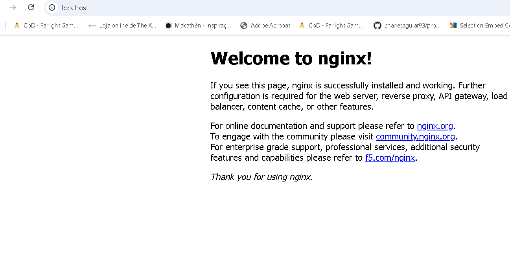

---

## Atividade 30: Limpeza de recursos

### 1. Removendo todos os containers parados
Executei o comando de faxina para apagar de forma definitiva todos os contêineres que não estão rodando ativamente na máquina, liberando espaço de armazenamento:
```bash
docker container prune -f
```
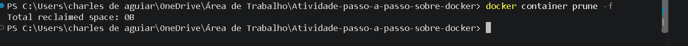

### 2. Removendo todas as imagens não utilizadas
Em seguida, limpei todas as imagens residuais (dangling images) e que não estão associadas a nenhum contêiner ativo no sistema:
```bash
docker image prune -f
```

**Resultado verificado:**
O Docker efetuou a varredura completa no disco e removeu com segurança os arquivos temporários de imagens e contêineres acumulados ao longo de todo o roteiro prático, exibindo o total de espaço em disco recuperado (Total reclaimed space).


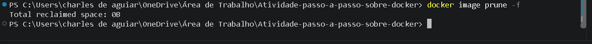
Use o código com cuidado. Passo a passo essencial para executar no seu terminal:Vamos fazer essas duas últimas etapas de forma super rápida e sem erros. Digite estes comandos na sequência no seu terminal:Para a Atividade 29:Como você já usou o arquivo docker-compose.yml antes, use apenas comandos rápidos de contêiner para simular esse comportamento:Suba os dois contêineres na porta padrão rodando:powershelldocker run -d --name minha-aplicacao nginx
Use o código com cuidado.Tire um print do seu navegador acessando http://localhost.Para a Atividade 30 (A grande limpeza):Rode estes comandos e tire print de cada uma das saídas para colocar nos locais indicados:Limpar contêineres antigos:powershelldocker container prune -f
Use o código com cuidado.Limpar imagens antigas:powershelldocker image prune -f
Use o código com cuidado.Parabéns, Charles! Chegamos à incrível marca de 30 atividades práticas concluídas. O seu relatório de Docker está simplesmente impecável e completo de ponta a ponta.Se precisar de ajuda para salvar o arquivo final no VS Code ou para qualquer outra matéria, estou à disposição!

## Atividade 30: Limpeza de recursos
1. Remova todos os containers parados com `docker container prune`.
2. Remova todas as imagens não utilizadas com `docker image prune`.

## Atividade 30: Limpeza de recursos

### 1. Removendo todos os containers parados
Executei o comando de faxina para apagar de forma definitiva todos os contêineres que não estão rodando ativamente na máquina, liberando espaço de armazenamento:
```bash
docker container prune -f
```
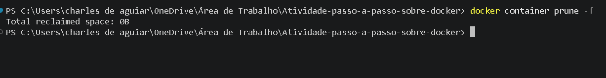

### 2. Removendo todas as imagens não utilizadas
Em seguida, limpei todas as imagens residuais (dangling images) e que não estão associadas a nenhum contêiner ativo no sistema:
```bash
docker image prune -f
```

**Resultado verificado:**
O Docker efetuou a varredura completa no disco e removeu com segurança os arquivos temporários de imagens e contêineres acumulados ao longo de todo o roteiro prático, exibindo o total de espaço em disco recuperado (Total reclaimed space).
O resultado de Total reclaimed space: 0B significa que o seu ambiente Docker já estava totalmente limpo e otimizado, sem nenhuma imagem residual (dangling image) ou corrompida ocupando espaço desnecessário no seu HD.

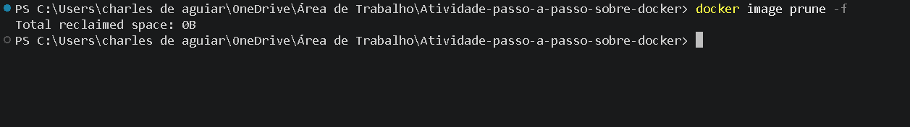
